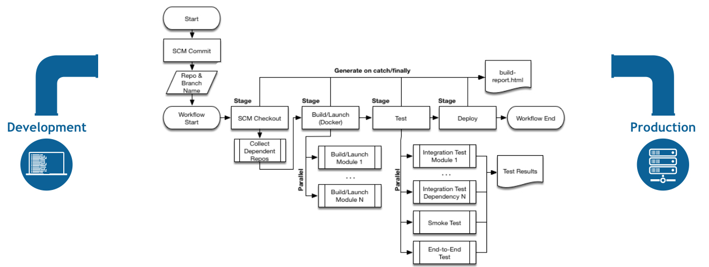
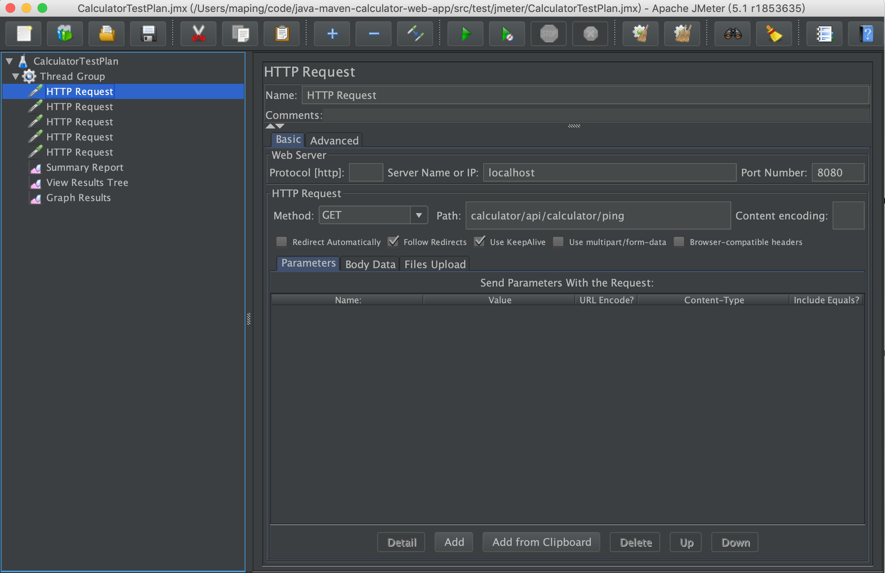
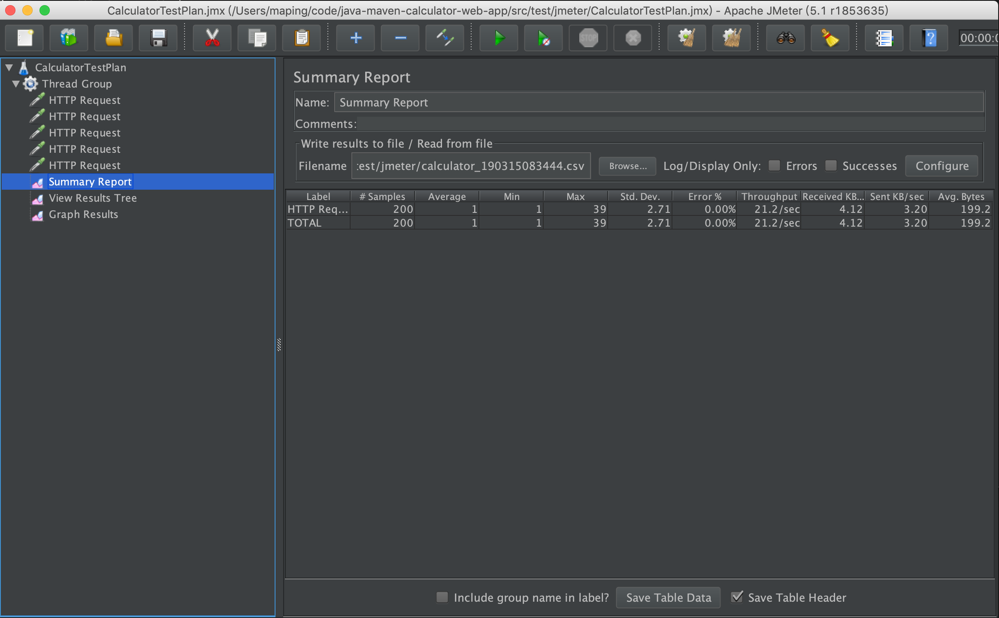
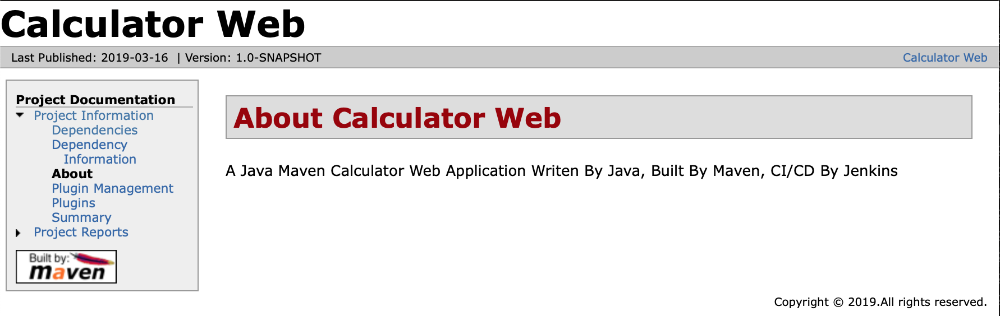

# A Java Maven Calculator Web App
A Java calculator web app, build by Maven, CI/CD by Jenkins.



## 1. Manualy Build, Test, and Deploy By Maven

### 1.1 Start Nexus (Optional)
```console
$ cd ~/sonatype/nexus/bin
$ ./nexus start 
```
Visit http://localhost:8081/ with admin/admin123.

### 1.2 Build
```console
$ mvn clean package -Dmaven.test.skip=true  
...
[INFO] Packaging webapp
[INFO] Assembling webapp [java-maven-calculator-web-app] in [/Users/maping/code/test/java-maven-calculator-web-app/target/calculator]
[INFO] Processing war project
[INFO] Copying webapp resources [/Users/maping/code/test/java-maven-calculator-web-app/src/main/webapp]
[INFO] Webapp assembled in [71 msecs]
[INFO] Building war: /Users/maping/code/test/java-maven-calculator-web-app/target/calculator.war
[INFO] ------------------------------------------------------------------------
[INFO] BUILD SUCCESS
[INFO] ------------------------------------------------------------------------
[INFO] Total time:  38.163 s
[INFO] Finished at: 2019-03-06T21:35:57+08:00
[INFO] ------------------------------------------------------------------------
```
>Explain: -DskipTests, not execute test case, but compile test case; -Dmaven.test.skip=true，not compile test case, neither execute test case.

>Attention: Due to China GFW, you may fail when you build this project. Try it outside China GFW.

### 1.3  Run Locally
```console
$ mvn jetty:run
[INFO] Scanning elapsed time=147ms
[INFO] DefaultSessionIdManager workerName=node0
[INFO] No SessionScavenger set, using defaults
[INFO] node0 Scavenging every 660000ms
[INFO] Started o.e.j.m.p.JettyWebAppContext@48535004{Calculator Web,/calculator,file:///Users/maping/code/java-maven-calculator-web-app/src/main/webapp/,AVAILABLE}{file:///Users/maping/code/java-maven-calculator-web-app/src/main/webapp/}
[INFO] Started ServerConnector@580fd26b{HTTP/1.1,[http/1.1]}{0.0.0.0:9999}
[INFO] Started @3779ms
[INFO] Started Jetty Server
```
By default, the jetty port is 9999, so you should visit following urls in browser:
- http://localhost:9999/calculator/api/calculator/ping
- http://localhost:9999/calculator/api/calculator/add?x=8&y=26
- http://localhost:9999/calculator/api/calculator/sub?x=12&y=8
- http://localhost:9999/calculator/api/calculator/mul?x=11&y=8
- http://localhost:9999/calculator/api/calculator/div?x=12&y=12

To run in a different port, `mvn jetty:run -Djetty.port=<Your-Port>`.

To debug locally, `set MAVEN_OPTS=-Xdebug -Xrunjdwp:transport=dt_socket,server=y,address=8000,suspend=n`, then `mvn jetty:run`.

To stop Jetty Server, press Control-C.

### 1.4 Run JUnit Test
```shell
$ mvn clean test
[INFO] -------------------------------------------------------
[INFO]  T E S T S
[INFO] -------------------------------------------------------
[INFO] Running com.qianhong.calculator.CalculatorServiceTest
[INFO] Tests run: 5, Failures: 0, Errors: 0, Skipped: 0, Time elapsed: 0.051 s - in com.qianhong.calculator.CalculatorServiceTest
[INFO] 
[INFO] Results:
[INFO] 
[INFO] Tests run: 5, Failures: 0, Errors: 0, Skipped: 0
```
### 1.5 Run Integration Test
```shell
$ mvn clean integration-test
[INFO] -------------------------------------------------------
[INFO]  T E S T S
[INFO] -------------------------------------------------------
[INFO] Running com.qianhong.calculator.CalculatorServiceIT
[INFO] Tests run: 5, Failures: 0, Errors: 0, Skipped: 0, Time elapsed: 0.782 s - in com.qianhong.calculator.CalculatorServiceIT
[INFO] 
[INFO] Results:
[INFO] 
[INFO] Tests run: 5, Failures: 0, Errors: 0, Skipped: 0
```
### 1.6 Deploy Your Web App to An Existed Tomcat 8x
Please install a Tomcat8x on your machine, after that, you need change pom.xml, point to your own Tomcat 8x.
```shell
$ mvn cargo:run
[INFO] [talledLocalContainer] 14-Mar-2019 10:10:19.495 信息 [main] org.apache.coyote.AbstractProtocol.start Starting ProtocolHandler ["http-nio-8080"]
[INFO] [talledLocalContainer] 14-Mar-2019 10:10:19.501 信息 [main] org.apache.coyote.AbstractProtocol.start Starting ProtocolHandler ["ajp-nio-8009"]
[INFO] [talledLocalContainer] 14-Mar-2019 10:10:19.503 信息 [main] org.apache.catalina.startup.Catalina.start Server startup in 2012 ms
[INFO] [talledLocalContainer] Tomcat 8.x started on port [8080]
[INFO] Press Ctrl-C to stop the container...
```
By default, the tomcat port is 8080, so you should visit following urls in browser:
- http://localhost:8080/calculator/api/calculator/ping
- http://localhost:8080/calculator/api/calculator/add?x=8&y=26
- http://localhost:8080/calculator/api/calculator/sub?x=12&y=8
- http://localhost:8080/calculator/api/calculator/mul?x=11&y=8
- http://localhost:8080/calculator/api/calculator/div?x=12&y=12

### 1.7 Run Performance Test with JMeter
>Important: make sure your Tomcat 8x is runing, before you run performance test.
```shell
$ mvn clean verify
[INFO] -------------------------------------------------------
[INFO]  P E R F O R M A N C E    T E S T S
[INFO] -------------------------------------------------------
[INFO]  
[INFO]  
[INFO] Executing test: CalculatorTestPlan.jmx
[INFO] Starting process with:[java, -Xms512M, -Xmx512M, -jar, ApacheJMeter-4.0.jar, -d, /Users/maping/code/java-maven-calculator-web-app/target/jmeter, -e, -j, /Users/maping/code/java-maven-calculator-web-app/target/jmeter/logs/CalculatorTestPlan.jmx.log, -l, /Users/maping/code/java-maven-calculator-web-app/target/jmeter/results/20190314-CalculatorTestPlan.csv, -n, -o, /Users/maping/code/java-maven-calculator-web-app/target/jmeter/reports/CalculatorTestPlan_20190314_104015, -t, /Users/maping/code/java-maven-calculator-web-app/target/jmeter/testFiles/CalculatorTestPlan.jmx]
[INFO] Creating summariser <summary>
[INFO] Created the tree successfully using /Users/maping/code/java-maven-calculator-web-app/target/jmeter/testFiles/CalculatorTestPlan.jmx
[INFO] Starting the test @ Thu Mar 14 10:40:26 CST 2019 (1552531226967)
[INFO] Waiting for possible Shutdown/StopTestNow/Heapdump message on port 4445
[INFO] summary +     16 in 00:00:03 =    5.2/s Avg:    32 Min:     2 Max:   288 Err:     0 (0.00%) Active: 1 Started: 4 Finished: 3
[INFO] summary +     34 in 00:00:06 =    5.7/s Avg:     2 Min:     1 Max:     5 Err:     0 (0.00%) Active: 0 Started: 10 Finished: 10
[INFO] summary =     50 in 00:00:09 =    5.5/s Avg:    12 Min:     1 Max:   288 Err:     0 (0.00%)
[INFO] Tidying up ...    @ Thu Mar 14 10:40:36 CST 2019 (1552531236412)
[INFO] ... end of run
[INFO] Completed Test: /Users/maping/code/java-maven-calculator-web-app/target/jmeter/testFiles/CalculatorTestPlan.jmx
[INFO] ------------------------------------------------------------------------
[INFO] BUILD SUCCESS
[INFO] ------------------------------------------------------------------------
[INFO] Total time:  59.487 s
[INFO] Finished at: 2019-03-14T10:40:37+08:00
[INFO] ------------------------------------------------------------------------
[INFO] Shutdown detected, destroying JMeter process...
```
### 1.8 Start Jmeter GUI (Optional)
If you want to see the test plan, you need install Jmeter, then start Jmeter GUI and open java-maven-calculator-web-app/src/test/jmeter/CalculatorTestPlan.jmx.
```console
$ cd ~/apache/jmeter/bin
$ ./jmeter 
```



Don't use GUI mode for load testing !, only for Test creation and Test debugging.For load testing, use CLI Mode:
```console
$ cd ~/apache/jmeter/bin
$ ./jmeter.sh -n -t ~/code/java-maven-calculator-web-app/src/test/jmeter/CalculatorTestPlan.jmx -Jusers=20 -Jloop=2 -l ~/code/java-maven-calculator-web-app/src/test/jmeter/calculator_`date +'%y%m%d%H%M%S'`.csv
Creating summariser <summary>
Created the tree successfully using /Users/maping/code/java-maven-calculator-web-app/src/test/jmeter/CalculatorTestPlan.jmx
Starting the test @ Sat Mar 16 22:07:52 CST 2019 (1552745272072)
Waiting for possible Shutdown/StopTestNow/HeapDump/ThreadDump message on port 4445
summary +    161 in 00:00:08 =   19.9/s Avg:     1 Min:     1 Max:    52 Err:     0 (0.00%) Active: 1 Started: 17 Finished: 16
summary +     39 in 00:00:02 =   25.7/s Avg:     1 Min:     0 Max:     3 Err:     0 (0.00%) Active: 0 Started: 20 Finished: 20
summary =    200 in 00:00:10 =   20.8/s Avg:     1 Min:     0 Max:    52 Err:     0 (0.00%)
Tidying up ...    @ Sat Mar 16 22:08:01 CST 2019 (1552745281987)
```
Open performance test result csv file:


### 1.9 Build Project Site
```console
$ mvn site
```
open java-maven-calculator-web-app/target/site/index.html


## 2. Automaticly Build, Test, and Deploy By Jenkins

### 2.1 Create and Configure a Freestyle Jenkins Project
Project name: MyJavaMavenCalculateWebApp

Execute every mvn goal one by one defined in Build Section Step: "Invoke top-level Maven targets"
### 2.2 Create and Configure a Freestyle Jenkins Project, using Publish Over FTP plugin
Project name: MyJavaMavenCalculateWebApp-AzureAppService-FTP
### 2.3 Create and Configure a Freestyle Jenkins Project, using Azure App Service plugin
Project name: MyJavaMavenCalculateWebApp-AzureAppService
### 2.4 Create and Configure a Pipeline Jenkins Project
Project name: MyJavaMavenCalculateWebApp-Pipeline

Execute the Jenkins Pipeline Script File: Jenkinsfile

## 3. Containerize Your Web App
1. Build a docker image using `Dockerfile`:
   ```
   docker build -t calculator .
   ```
2. Run docker image locally
   ```
   docker run --rm -p 8080:8080 calculator
   ```
3. Then you can access the web app at http://localhost:8080/api/calculator/ping in browser

4. Stop container
   ```
   docker ps -a
   docker stop <Container-ID>
   ```
5. Push your local image to your docker hub repositories
   ```
   docker login -u <Your-Docker-ID> -p <Your-Docker-Password>
   docker tag calculator <Your-Docker-ID>/calculator
   docker push <Your-Docker-ID>/calculator
   ```
## 4. Deploy to Azure Web App using Container Image in Docker Hub
1. Create a Web App in Linux on Azure
2. Save the changes and you'll be able to access the web app in a few seconds.

## 5. Deploy to Your Azure Web App using Container Image in ACR
1. Create a Container Registry on Azure
2. Push your local image to ACR:
   ```
   docker login <Your-ACR-Login-Server> -u <Your-ACR-Username> -p <Your-ACR-Password>
   docker tag calculator <Your-ACR-Login-Server>/calculator
   docker push <Your-ACR-Login-Server>/calculator
   ```
3. Create a Web App in Linux on Azure
4. In Docker Container settings of Web App, fill in image name, server URL, username and password of your ACR.
5. Save the changes and you'll be able to access the web app in a few seconds.

## Reference
- [Jenkins Pipeline](https://jenkins.io/doc/book/pipeline/)


